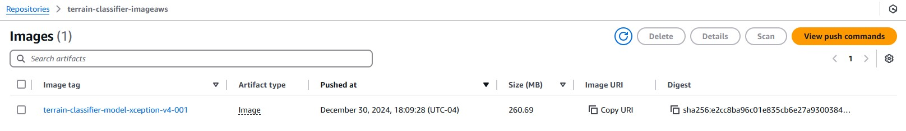
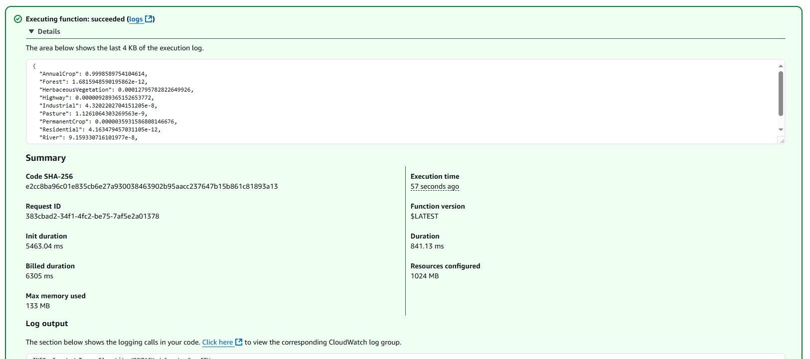

# Data Talks Club - Machine Learning Zoomcamp
# Capstone Project 1

## Satellite Terrain Image Classification

### Introduction

Satellite imagery provides a unique perspective on our planet, capturing vast extensions of land and sea with unparalleled detail. However, manually analyzing these images for specific features like land cover (forests, urban areas, water bodies, industrial areas), crop types, or disaster zones is a time-consuming and labor-intensive task. This project aims to leverage the power of Convolutional Neural Networks (CNNs), a class of deep learning algorithms particularly adept at image analysis, to automate the classification of satellite images.

#### Potential Use Cases

**Precision Agriculture:**
- Crop Monitoring: Classify different crop types to optimize irrigation, fertilization, and pest control.
- Disease Detection: Identify diseased crops or areas affected by drought.

**Environmental Monitoring:**
- Deforestation Detection: Track deforestation rates and identify areas of illegal logging.
- Land Cover Mapping: Create accurate and up-to-date maps of land cover types (forests, grasslands, urban areas).
- Coastal Erosion Monitoring: Assess coastal erosion rates and predict potential risks.

**Disaster Management:**
- Flood Detection: Identify flooded areas and assess the extent of damage.
- Wildfire Detection: Early detection of wildfires to aid in rapid response and containment efforts.
- Earthquake Damage Assessment: Rapidly assess the extent of damage to infrastructure and buildings.

**Urban Planning:**
- Urban Growth Monitoring: Track urban expansion and identify areas of high population density.
- Infrastructure Mapping: Map roads, buildings, and other infrastructure for urban planning and development.

This project has the potential to significantly impact various fields by providing valuable insights from satellite imagery in a more efficient and accurate manner.

### Core objective of this project

1. **Data aquisition and preparation**. In this case we are using the EuroSAT dataset. The dataset is based on Sentinel-2 satellite images covering 13 spectral bands and consisting out of 10 classes with in total 27,000 labeled and geo-referenced images. A more detailed description of this dataset can be found [here]('https://github.com/phelber/eurosat')

2. **Model Selection**. In this case we'll use Convolutional Neural Network as the ML model. As the framework for training and tunning the model we'll use Tensorflow and Keras.

3. **Model Training and Tunning**. We'll use parameters like learning rate, dropout rate and data augmentation as the parameters to tune our model.

4. **Prediction**. Utilize the trained model to classify satellite images based on the 10 categories available on the dataset.

5. **Containerization**. To be able to reproduce this result, the model will be placed on a Docker container. 

6. **Model deployment**. Finally, now that the model was placed on a Docker container, the last step of the project will be to setup a serverless deployment environment on AWS and run the project from there.

### Availabe files on the repository

| File | Description |
| ----------- | ----------- |
| notebook.ipynb | Jupyter Notebook where data loading and Model tunning was performed |
| predict.py | Python script that runs the project as a Flask service. |
| request.py | Python script that submit a terrain image to the predict service and return if the terrain class as the result of the classification model. The script includes links to different images to try the model |
| requirements.txt | All the python libraries that are needed to run the service. It is used by the Docker container to make sure all the modules are installed |
| model_vf_24_0.958.h5.keras | Convolutional Neural Network model exported from the Jupyter Notebook after training and tunning was performed |
| terrain-classification.tflite | Same model as before but converted to TensorFlow Lite |
| tf-lite_model_conversion.ipynb | Jupyter Notebook where conversion from original model to Tensorflow Lite was performed and tested |
| train.ipynb / train.py | Jupyter Notebook and python script with all the steps to train the model. Both files were included as depending on the environment available it would be easier to load a notebook on something like to Kaggle or Google Colab to have access to VMs with GPUs |
| serverless | Directory with the files created to deploy the model on AWS Lambda Function | 

### How to run this project


1. Download all the files or clone this repository on your system. To clone the repo, you can execute the following command from the shell:

``` sh
git clone https://github.com/juangrau/ML-Capstone-Project-1.git
```

2. Navigate to the project directory on your terminal.

3. build and run the docker image:

``` sh
docker build -t terrain-classifier .

docker run -it -p 9696:9696 terrain-classifier:latest
```

The scope of this image is a web service based on Flask that allows to predict if a tele-marketing campaign will be successful for a customer of a bank.

To test it you can run the script request.py like this:

``` sh
python requst.py
```

Make sure you have the requests library installed. To install it you can run the follwing command on the terminal

``` sh
pip install requests
```

### AWS Lambda Deployment

As described on the table above there the **serverless** directory contains all the files required to deploy the project as a AWS Lambda function.

The lambda function was deployed using a Docker container.

To test this container you can follow these steps:

1. Navigate to the serverless directory located into the project folder on your terminal.

2. build and run the docker image:

``` sh
docker build -t terrain-classifier-imageaws .

docker run -it -p 8080:8080 terrain-classifier-imageaws:latest
```

To test it you can run the script test.py like this:

``` sh
python test.py
```

You can find below some screen captures of AWS console with the Docker container upladed on a repository on AWS ECR



Then, the following image is a screen capture of the lambda function defined based on the Docker container.


Finally, the following image is a screen capture of the test result of this lambda function.



